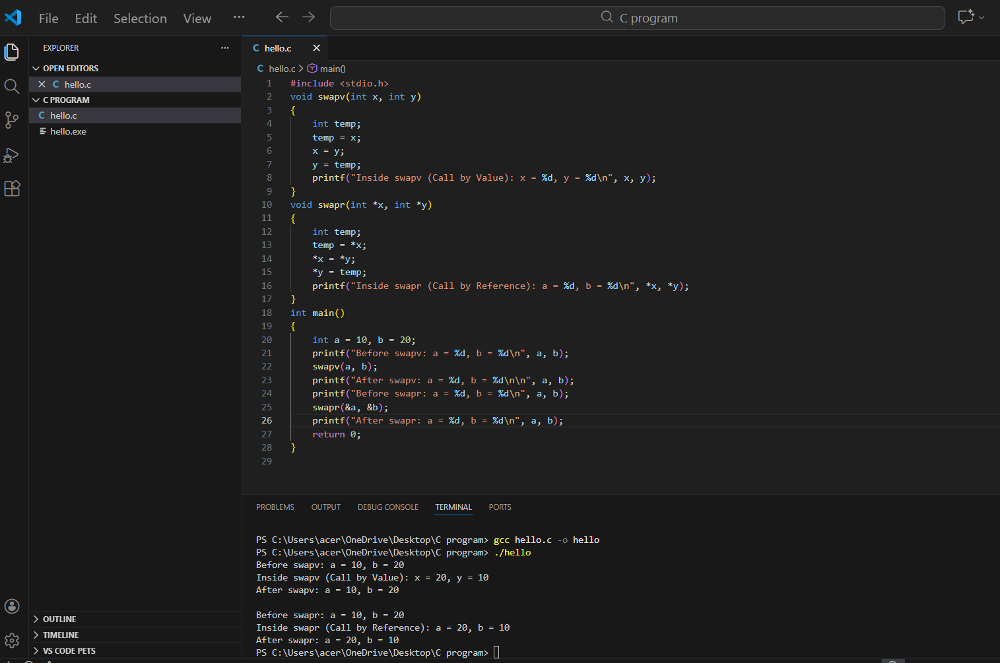
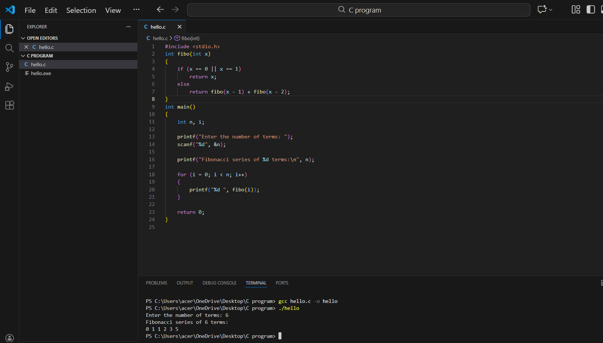
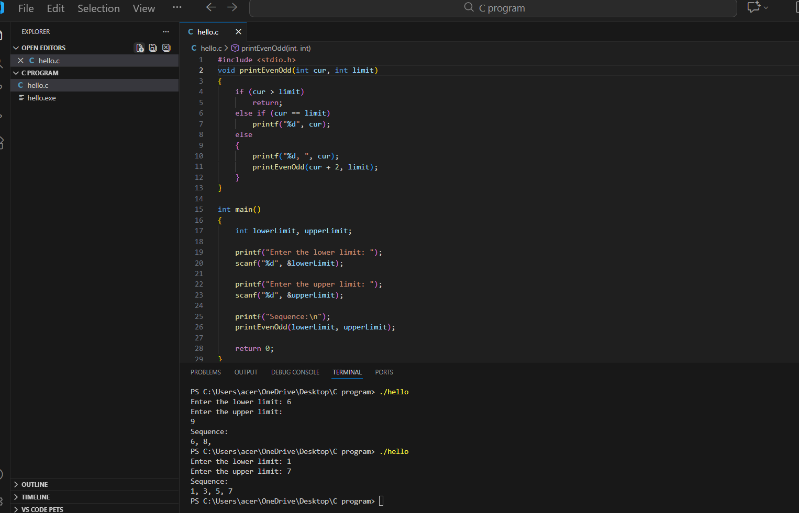
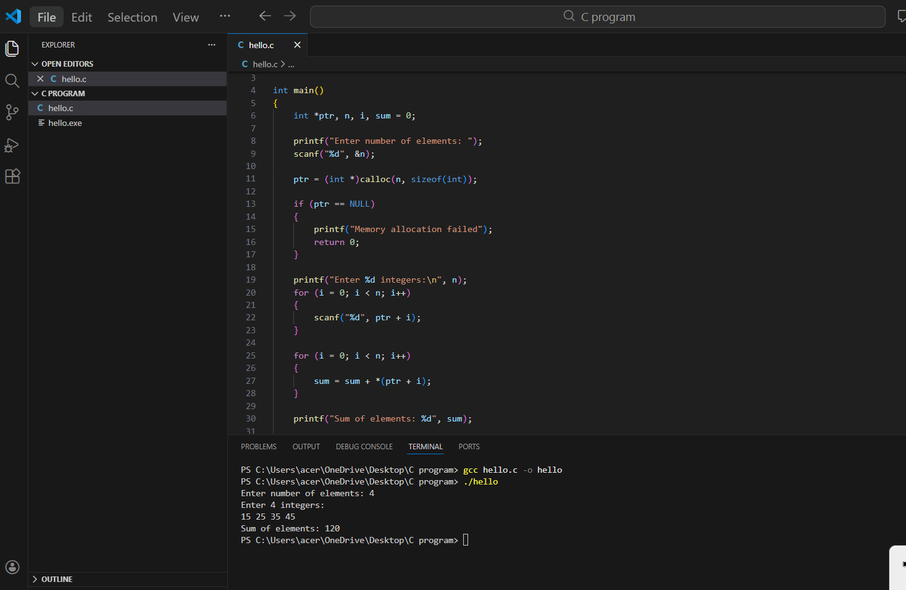
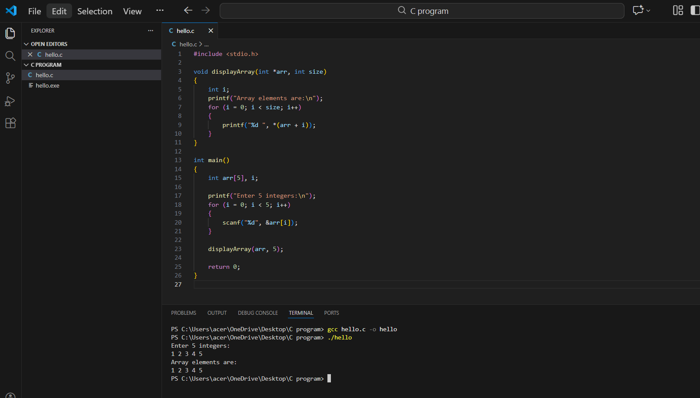

# 19AI304-Fundamentals-of-C-Programming-2025-Odd-M5
# IAPR-5- Module 5 - FoC
## 9. Implementation of recursion.
## 10. Implementation of programs using pointer arithmetic.
# Ex.No:21
  Implement a C program to demonstrate call by value and call by reference by swapping two integers using separate functions.
# Date : 26-12-25
# Aim:
 To implement a C program that illustrates the difference between call by value and call by reference by swapping two integer variables using two separate functions.
# Algorithm:
### Step 1:
  Start
### Step 2: 
  Include the standard input-output library: #include<stdio.h>.
### Step 3:
  Declare two functions:
  - `swapv(int, int)` for swapping using call by value  
  - `swapr(int *, int *)` for swapping using call by reference
### Step 4: 
  In the `main()` function, declare two integer variables `a` and `b` and initialize them with values (e.g., 10 and 20).
### Step 5: 
  Print the values of `a` and `b` before calling `swapv()`.
### Step 6: 
  Call the function `swapv(a, b)` and print the values of `a` and `b` after the function call to show that call by value does not change the original values.
### Step 7: 
  Print the values of `a` and `b` before calling `swapr()`.
### Step 8: 
  Call the function `swapr(&a, &b)` using the addresses of `a` and `b`.
### Step 9: 
  Print the values of `a` and `b` after the `swapr()` function call to show that call by reference successfully swaps the original values.
### Step 10: 
  Inside `swapv(x, y)` function:
  - **Step 10.1:** Swap the values of `x` and `y` using a temporary variable.  
  - **Step 10.2:** Print the swapped values (formal parameters).
### Step 11: 
  Inside `swapr(*x, *y)` function:
  - **Step 11.1:** Swap the values pointed to by `x` and `y`.  
  - **Step 11.2:** Print the swapped values (affects actual parameters).
### Step 12: 
  Stop
# Program:
```
#include <stdio.h>

/* Function for call by value */
void swapv(int x, int y)
{
    int temp;
    temp = x;
    x = y;
    y = temp;
    printf("Inside swapv (Call by Value): x = %d, y = %d\n", x, y);
}

/* Function for call by reference */
void swapr(int *x, int *y)
{
    int temp;
    temp = *x;
    *x = *y;
    *y = temp;
    printf("Inside swapr (Call by Reference): a = %d, b = %d\n", *x, *y);
}

int main()
{
    int a = 10, b = 20;

    printf("Before swapv: a = %d, b = %d\n", a, b);
    swapv(a, b);
    printf("After swapv: a = %d, b = %d\n\n", a, b);

    printf("Before swapr: a = %d, b = %d\n", a, b);
    swapr(&a, &b);
    printf("After swapr: a = %d, b = %d\n", a, b);

    return 0;
}

```
# Output:



# Result: 
  Thus, the program was implemented and executed successfully, and the required output was obtained.


# 19AI304-Fundamentals-of-C-Programming-2025-Odd-M5
# IAPR-5- Module 5 - FoC
# Ex.No:22
  Implement a C program to generate the Fibonacci series using a recursive function. The program should accept a positive integer n and display the first n terms of the Fibonacci sequence.
# Date : 26-12-25
# Aim:
  To implement a C program that uses a recursive function to generate and display the Fibonacci series for a given number of terms.
# Algorithm:
### Step 1:
  Start
### Step 2: 
  Include the standard input-output library: #include<stdio.h>.
### Step 3:
  Declare a recursive function `fibo(int x)` that returns the Fibonacci number at position `x`.  
### Step 4:
  In the `main()` function, declare variables `n` and `i`.  
### Step 5:
  Prompt the user to enter a positive integer `n`.  
### Step 6:
  Read the value of `n`.  
### Step 7:
  Display a message indicating that the Fibonacci series of `n` terms will be printed.  
### Step 8:
  Use a `for` loop from `i = 0` to `i < n` to:  
  - **Step 8.1:** Call the recursive function `fibo(i)`  
  - **Step 8.2:** Print the returned Fibonacci value  
### Step 9:
 Define the recursive function `fibo(x)` as follows:  
 - **Step 9.1:** If `x == 0` or `x == 1`, return `x`.  
 - **Step 9.2:** Otherwise, return `fibo(x - 1) + fibo(x - 2)`.  
### Step 10:
  Stop
# Program:
```
#include <stdio.h>

/* Recursive function to find Fibonacci number */
int fibo(int x)
{
    if (x == 0 || x == 1)
        return x;
    else
        return fibo(x - 1) + fibo(x - 2);
}

int main()
{
    int n, i;

    printf("Enter the number of terms: ");
    scanf("%d", &n);

    printf("Fibonacci series of %d terms:\n", n);

    for (i = 0; i < n; i++)
    {
        printf("%d ", fibo(i));
    }

    return 0;
}

```
# Output:



# Result: 
Thus, the program was implemented and executed successfully, and the required output was obtained.


# 19AI304-Fundamentals-of-C-Programming-2025-Odd-M5
# IAPR-5- Module 5 - FoC
# Ex.No:23
   Implement a C program to demonstrate recursion by printing a sequence of even or odd numbers from a given lower limit to an upper limit, with each recursive call progressing by 2.
# Date : 26-12-25
# Aim:
  To implement a C program that uses a recursive function to print even or odd numbers in a specified range based on the starting value provided by the user.
# Algorithm:
### Step 1:
  Start
### Step 2: 
  Include the standard input-output library: #include<stdio.h>. 
### Step 3:
  Declare a recursive function `printEvenOdd(int cur, int limit)` to print numbers from `cur` to `limit` with a step of 2.
### Step 4:
  In the `main()` function, declare two integer variables: `lowerLimit` and `upperLimit`.
### Step 5:
  Prompt the user to enter the lower limit of the range.
### Step 6:
  Read and store the lower limit.
### Step 7:
  Prompt the user to enter the upper limit of the range.
### Step 8:
  Read and store the upper limit.
### Step 9:
  Display a message indicating that the even/odd numbers in the given range will be printed.
### Step 10:
  Call the recursive function `printEvenOdd(lowerLimit, upperLimit)`.
### Step 11:
  Inside the function `printEvenOdd(cur, limit)`:
  - **Step 11.1:** If `cur > limit`, terminate the recursion.  
  - **Step 11.2:** If `cur == limit`, print the value without a trailing comma.  
  - **Step 11.3:** Otherwise, print the current value followed by a comma.  
  - **Step 11.4:** Recursively call `printEvenOdd(cur + 2, limit)` to print the next number.
### Step 12:
  Stop
# Program:
```
#include <stdio.h>

/* Recursive function to print even or odd numbers */
void printEvenOdd(int cur, int limit)
{
    if (cur > limit)
        return;
    else if (cur == limit)
        printf("%d", cur);
    else
    {
        printf("%d, ", cur);
        printEvenOdd(cur + 2, limit);
    }
}

int main()
{
    int lowerLimit, upperLimit;

    printf("Enter the lower limit: ");
    scanf("%d", &lowerLimit);

    printf("Enter the upper limit: ");
    scanf("%d", &upperLimit);

    printf("Sequence:\n");
    printEvenOdd(lowerLimit, upperLimit);

    return 0;
}

```
# Output:



# Result: 
Thus, the program was implemented and executed successfully, and the required output was obtained.


# 19AI304-Fundamentals-of-C-Programming-2025-Odd-M5
# IAPR-5- Module 5 - FoC
# Ex.No:24
   Implement a C program that dynamically allocates memory using calloc(), accepts integer inputs from the user, computes their sum, and prints the sum.
# Date : 26-12-25
# Aim:
  To implement a C program that dynamically allocates memory for an array of integers using calloc(), accepts elements from the user, computes their sum, and displays the sum.
# Algorithm:
### Step 1:
  Start
### Step 2: 
  Include the standard input-output library: #include<stdio.h>. 
### Step 3:
  a. Declare a pointer `ptr` to `int`.  
  b. Declare integers `n`, `i`, and `sum` (initialize `sum = 0`).
### Step 4:
  Read the integer `n` from the user (the number of integers to be stored).
### Step 5:
  Use the `calloc()` function to allocate memory for `n` integers:  
  `ptr = calloc(n, sizeof(int))`
### Step 6:
  If `ptr` is not `NULL`, continue to the next step; otherwise, memory allocation failed (the program exits).
### Step 7:
  For each `i` from `0` to `n - 1`:  
  a. Read an integer from the user.  
  b. Store it at memory location `ptr + i`.
### Step 8:
  For each `i` from `0` to `n - 1`:  
  a. Access the value stored at `ptr + i`.  
  b. Add it to `sum`.
### Step 9:
  Print the value of `sum`.
### Step 10:
  Call `free(ptr);` to release the memory allocated by `calloc()`.
### Step 11:
  Stop
# Program:
```
#include <stdio.h>
#include <stdlib.h>

int main()
{
    int *ptr, n, i, sum = 0;

    printf("Enter number of elements: ");
    scanf("%d", &n);

    ptr = (int *)calloc(n, sizeof(int));

    if (ptr == NULL)
    {
        printf("Memory allocation failed");
        return 0;
    }

    printf("Enter %d integers:\n", n);
    for (i = 0; i < n; i++)
    {
        scanf("%d", ptr + i);
    }

    for (i = 0; i < n; i++)
    {
        sum = sum + *(ptr + i);
    }

    printf("Sum of elements: %d", sum);

    free(ptr);
    return 0;
}

```
# Output:



# Result: 
Thus, the program was implemented and executed successfully, and the required output was obtained.


# 19AI304-Fundamentals-of-C-Programming-2025-Odd-M5
# IAPR-5- Module 5 - FoC
# Ex.No:25
   Implement a C program that reads a set of integers into an array and displays the array elements using a user-defined function.
# Date : 26-12-25
# Aim:
  To implement a C program that reads integers into an array and displays the elements using a user-defined function.
# Algorithm:
### Step 1:
  Start
### Step 2: 
  Include the standard input-output library: #include<stdio.h>. 
### Step 3:
  Declare the function prototype: `void displayArray(int *arr, int size);`
### Step 4:
  In the `main()` function, declare an integer array of size 5 and a loop variable.
### Step 5:
  Prompt the user to enter the required number of integers.
### Step 6:
  Read the integers from the user and store them in the array using a loop.
### Step 7:
  Call the `displayArray` function, passing the array and its size as arguments.
### Step 8:
  Define the function `displayArray(int *arr, int size)` to print the array elements:  
  - Loop through the array using either pointer arithmetic (`*(arr + i)`) or array indexing (`arr[i]`).  
  - Print each element.
### Step 9:
  Return to the `main()` function after displaying the array.
### Step 10:
  Stop
# Program:
```
#include <stdio.h>

void displayArray(int *arr, int size)
{
    int i;
    printf("Array elements are:\n");
    for (i = 0; i < size; i++)
    {
        printf("%d ", *(arr + i));
    }
}

int main()
{
    int arr[5], i;

    printf("Enter 5 integers:\n");
    for (i = 0; i < 5; i++)
    {
        scanf("%d", &arr[i]);
    }

    displayArray(arr, 5);

    return 0;
}

```
# Output:



# Result: 
Thus, the program was implemented and executed successfully, and the required output was obtained.
